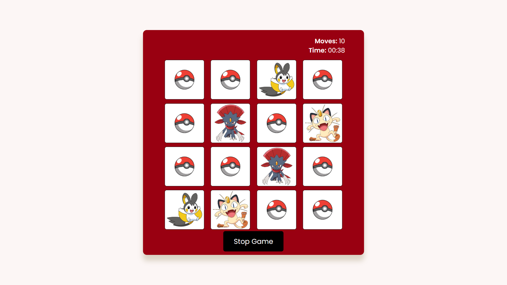
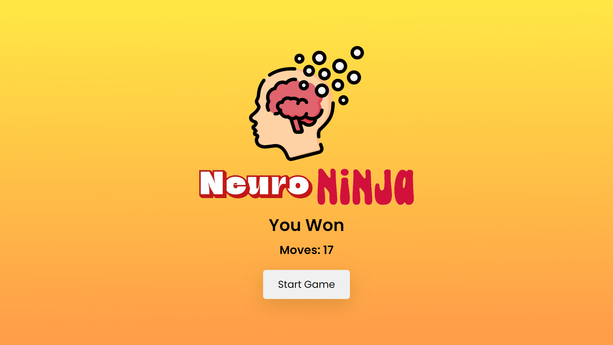
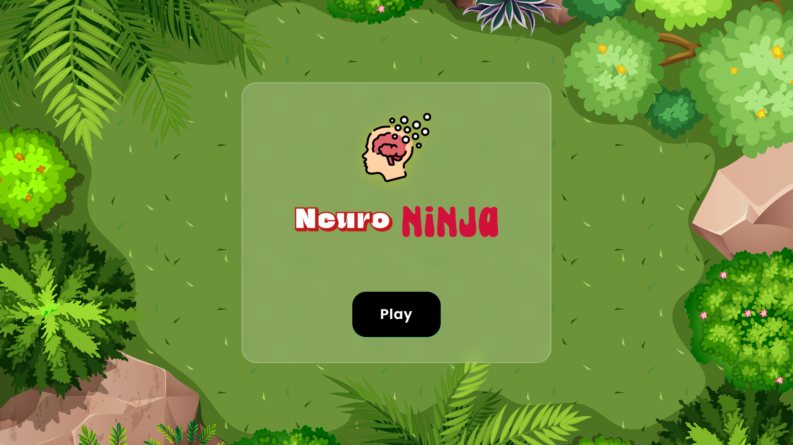
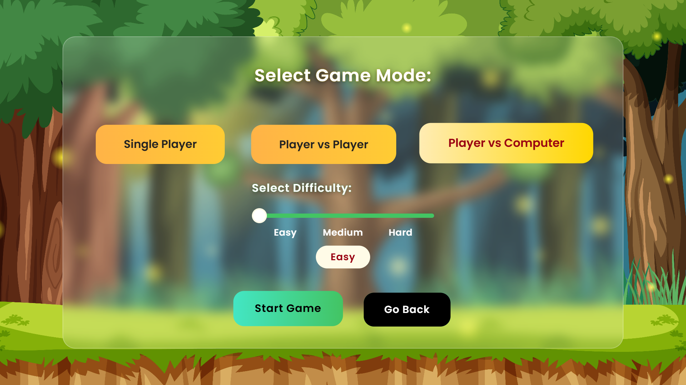
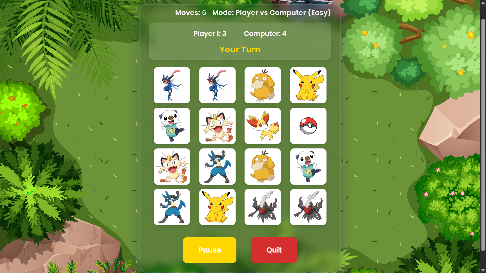
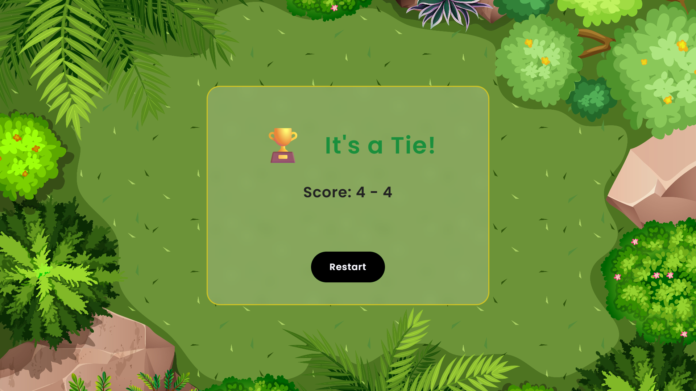
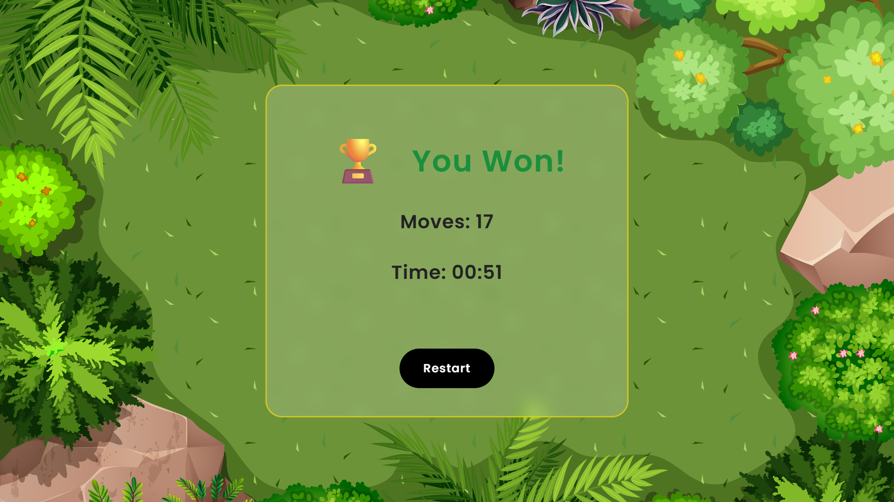
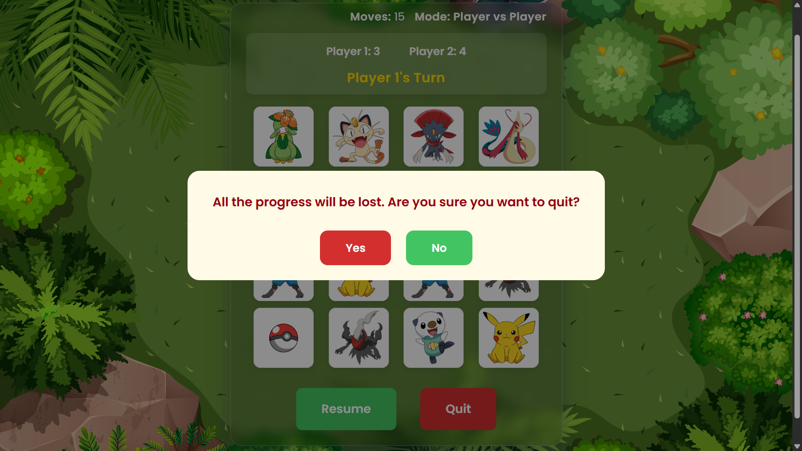

# 🧠⚡NeuroNinja - Memory Game


Welcome to **NeuroNinja** – an immersive and interactive memory card game built with HTML, CSS, and JavaScript, designed to sharpen your brain while delivering an exciting gaming experience.

---

## 🚀 Table of Contents

- [✨ Features](#-features)
- [🌐 Deployment](#-deployment)
- [📸 Screenshots](#-screenshots)
- [🎮 How to Play](#-how-to-play)
- [🌱 Future Scope](#-future-scope)
- [💻 Installation](#-installation)
- [🤝 Contributing](#-contributing)
- [📬 Contact](#-contact)

---

## ✨ Features

✅ **Responsive Design** – Seamless gameplay across mobiles, tablets, and desktops  
✅ **Multiple Game Modes** – Play solo, challenge a friend, or test your skills against the computer  
✅ **Difficulty Levels** – Easy, medium, and hard modes for vs computer  
✅ **Engaging Sound Effects** – Immersive sounds to enhance the experience  
✅ **Pause & Resume** – Continue from where you left off anytime  
✅ **Interactive Animations** – Smooth card flip animations and transitions  
✅ **Updated UI/UX** – New card designs, improved layout, and vibrant themes for a refreshing look

---

## 🌐 Deployment

Play the live version here:

🔗 [NeuroNinja Memory Game](https://official-tushar.github.io/Memory-Game/)

---


## 📸 Screenshots

Here’s a glimpse of **NeuroNinja** in action:

### 🏁 Game Start


### 🎮 Gameplay



### 🏆 Game End



Updated look of the NeuroNinja game in action with more features and more exciting:

### ✨ Updated Game Start



### 🎲 Game Modes



### 🔄 Enhanced Gameplay



### 📊 Game Score



### 👤 Single Player Score



### 💡 Improved UX & New Features



---

## 🎮 How to Play

1. **Start:** Open the game in your browser.  
2. **Choose Mode:** Select solo, dual, or vs computer mode.  
3. **Select Difficulty:** Choose easy, medium, or hard when playing against the computer.  
4. **Flip Cards:** Click cards to flip and reveal images.  
5. **Match Pairs:** Find matching pairs to score points.  
6. **Pause / Resume / Quit:** Take breaks with pause and resume options or quit anytime.  
7. **Win:** Match all pairs with the fewest moves or before your opponent in multiplayer mode.

---

## 🌱 Future Scope

🚀 **Multiple Themes:** Unlock diverse themes and card designs  
🌐 **Real-time Arena:** Compete with friends online in real-time  
🏅 **Leaderboards:** Track high scores globally and challenge top players  
♿ **Accessibility:** Enhanced features for inclusive gameplay

---

## 💻 Installation

To run the NeuroNinja game locally:

1. **Clone the Repository:**

   ```bash
   https://github.com/official-Tushar/Memory-Game.git

2. **Navigate to the Project Directory:**

   ```bash
   cd Neuro-Ninja

3. **Open index.html in Your Web Browser:**

   Simply double-click the index.html file or open it with your preferred web browser.

---

## 🤝 Contributing

💡 Contributions, ideas, and feature suggestions are welcome!

  - Fork the repository
  - Create a new branch
  - Commit your changes
  - Submit a pull request

---

## 📬 Contact

If you have any questions or feedback, feel free to reach out:

Tushar Srivastava: [GitHub](https://github.com/official-Tushar) | 
[Email](mailto:tusharsrivastava8404@gmail.com) |
[LinkedIn](https://www.linkedin.com/in/tusharsrivastava8404/)

---

Thank you for checking out my Memory game project! I hope you find it entertaining and engaging.
